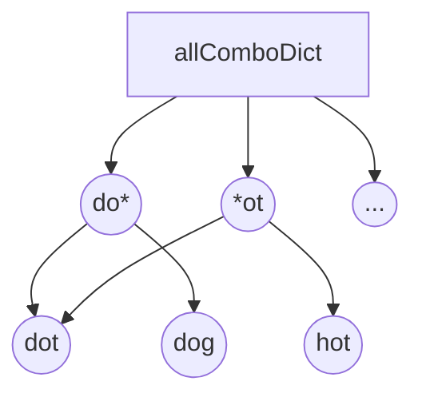

[toc]

# 127. Word Ladder

>  https://leetcode.com/problems/word-ladder/

> Given two words (*beginWord* and *endWord*), and a dictionary's word list, find the length of shortest transformation sequence from *beginWord* to *endWord*, such that:
>
> 1. Only one letter can be changed at a time.
> 2. Each transformed word must exist in the word list. Note that *beginWord* is *not* a transformed word.

## Approach 1 : Graph BFS


```c++
class Solution {
public:
	int ladderLength(string beginWord, string endWord, vector<string>& wordList) {
		int ret = 0;
		map<string, vector<string>> graph;
		set<string> visited;
		wordList.push_back(beginWord);
		construct_graph(wordList, graph);
		ret = bfs(beginWord, endWord, graph, visited);
		return ret;
	}

	bool connect(string &word1, string &word2) {
		int count = 0;
		for (int i = 0; i < word1.size(); i++) {
			if (word1[i] != word2[i]) count++;
		}
		return count == 1;
	}

	void construct_graph(vector<string>& wordList, map<string, vector<string>>& graph) {
		for (int i = 0; i < wordList.size() - 1; i++) {
			for (int j = i + 1; j < wordList.size(); j++) {
				if (connect(wordList[i], wordList[j])) {
					graph[wordList[i]].push_back(wordList[j]);
					graph[wordList[j]].push_back(wordList[i]);
				}
			}
		}

	}

	int bfs(string &beginWord, string &endWord, map<string, vector<string>>& graph, set<string> &visited) {
		int ret = 0;
		queue<pair<string, int>> q;
		q.push(pair(beginWord, 1));
		visited.insert(beginWord);
		pair<string, int> cur;
		while (!q.empty()) {
			cur = q.front();
			q.pop();
			if (cur.first == endWord) return cur.second;
			for (int i = 0; i < graph[cur.first].size(); i++) {
				if (visited.find(graph[cur.first][i]) == visited.end()) {
					q.push(pair(graph[cur.first][i], cur.second + 1));
					visited.insert(graph[cur.first][i]);
				}
			}
		}
		return 0;
	}
};
```

>Runtime: 700 ms, faster than 32.34% of C++ online submissions for Word Ladder.
>
>Memory Usage: 27.3 MB, less than 34.09% of C++ online submissions for Word Ladder.

<table><tr><td bgcolor=PaleTurquoise>START : Use int instead of string</td></tr></table>

```c++
class Solution {
public:
	int ladderLength(string beginWord, string endWord, vector<string>& wordList) {
        int ret = 0;
        wordList.push_back(beginWord);
        
        int n = wordList.size();
		vector<vector<int>> graph(n);
		vector<bool> visited(n, false);
		int endIndex = construct_graph(wordList, graph, endWord);
        
		ret = bfs(n-1, endIndex, graph, visited);
		return ret;
	}

	bool connect(string &word1, string &word2) {
		int count = 0;
		for (int i = 0; i < word1.size(); i++) {
			if (word1[i] != word2[i]) count++;
		}
		return count == 1;
	}

	int construct_graph(vector<string>& wordList,  vector<vector<int>>& graph, string& endWord) {
        int endIndex = -1;
		for (int i = 0; i < wordList.size() - 1; i++) {
            if(endIndex < 0 && wordList[i] == endWord) endIndex = i;
			for (int j = i + 1; j < wordList.size(); j++) {
				if (connect(wordList[i], wordList[j])) {
					graph[i].push_back(j);
					graph[j].push_back(i);
				}
			}
		}
        return endIndex;
	}

      int bfs(int beginWord, int endWord, vector<vector<int>>& graph, vector<bool>& visited) {
            int ret = 0;
            queue<pair<int, int>> q;
            q.push(pair(beginWord, 1));
            visited[beginWord] = true;
            pair<int, int> cur;
            while (!q.empty()) {
                cur = q.front();
                q.pop();
                if (cur.first == endWord) return cur.second;
                for (int i = 0; i < graph[cur.first].size(); i++) {
                    if (!visited[graph[cur.first][i]]) {
                        q.push(pair(graph[cur.first][i], cur.second + 1));
                        visited[cur.first] = true;
                    }
                }
            }
            return 0;
        }
};
```

> Runtime: 592 ms, faster than 34.81% of C++ online submissions for Word Ladder.
>
> Memory Usage: 18 MB, less than 45.45% of C++ online submissions for Word Ladder.

### Complexity Analysis

* Time complexity : $$O(N^2M )$$, where M is the length of words and N is the total number of words in the input list.

  Constructing the graph takes $$N^2M$$.

<table><tr><td bgcolor=PaleTurquoise>  END </td></tr></table>
```java

class Solution {
    class Pair {
        String first;
        int second;

        Pair(String first, int second) {
            this.first = first;
            this.second = second;
        }
    }

    public int ladderLength(String beginWord, String endWord, List<String> wordList) {
        int ret = 0;
        Map<String, List<String>> graph = new HashMap<>();

        Set<String> visited = new HashSet<>();
        wordList.add(beginWord);

        for (int i = 0; i < wordList.size(); i++) {
            graph.put(wordList.get(i), new ArrayList<String>());
        }

        construct_graph(wordList, graph);

        return bfs(beginWord, endWord, graph, visited);
    }

    boolean connect(String word1, String word2) {
        int count = 0;
        for (int i = 0; i < word1.length(); i++) {
            if (word1.charAt(i) != word2.charAt(i)) count++;
        }
        return count == 1;
    }

    void construct_graph(List<String> wordList, Map<String, List<String>> graph) {
        String istr;
        String jstr;
        for (int i = 0; i < wordList.size() - 1; i++) {
            for (int j = i + 1; j < wordList.size(); j++) {
                istr = wordList.get(i);
                jstr = wordList.get(j);
                if (connect(istr, jstr)) {
                    graph.get(istr).add(new String(jstr));
                    graph.get(jstr).add(new String(istr));
                }
            }
        }
    }

    int bfs(String beginWord, String endWord, Map<String, List<String>> graph, Set<String> visited) {
        int ret = 0;
        List<String> list;
        Queue<Pair> q = new LinkedList<>();
        q.add(new Pair(beginWord, 1));
        visited.add(beginWord);
        Pair cur;
        while (0 != q.size()) {
            cur = q.remove();
            if (cur.first.equals(endWord)) return cur.second;
            list = graph.get(cur.first);
            for (int i = 0; i < list.size(); i++) {
                if (visited.contains(list.get(i)) == false) {
                    q.add(new Pair(list.get(i), cur.second + 1));
                    visited.add(list.get(i));
                }
            }
        }
        return 0;
    }
};
```

> Runtime: 779 ms, faster than 7.44% of Java online submissions for Word Ladder.
>
> Memory Usage: 42 MB, less than 45.99% of Java online submissions for Word Ladder.

## Approach 2 : BFS

> ```
> Input:
> wordList = ["hot","dot","dog"]
> ```




```java
class Solution {
  public int ladderLength(String beginWord, String endWord, List<String> wordList) {

    // Since all words are of same length.
    int L = beginWord.length();

    // Dictionary to hold combination of words that can be formed,
    // from any given word. By changing one letter at a time.
    Map<String, List<String>> allComboDict = new HashMap<>();

    wordList.forEach (
        word -> {
          for (int i = 0; i < L; i++) {
            // Key is the generic word
            // Value is a list of words which have the same intermediate generic word.
            String newWord = word.substring(0, i) + '*' + word.substring(i + 1, L);
            List<String> transformations = allComboDict.getOrDefault(newWord, new ArrayList<>());
            transformations.add(word);
            allComboDict.put(newWord, transformations);
          }
        });

    // Queue for BFS
    Queue<Pair<String, Integer>> Q = new LinkedList<>();
    Q.add(new Pair(beginWord, 1));

    // Visited to make sure we don't repeat processing same word.
    Map<String, Boolean> visited = new HashMap<>();
    visited.put(beginWord, true);

    while (!Q.isEmpty()) {
      Pair<String, Integer> node = Q.remove();
      String word = node.getKey();
      int level = node.getValue();
      for (int i = 0; i < L; i++) {

        // Intermediate words for current word
        String newWord = word.substring(0, i) + '*' + word.substring(i + 1, L);

        // Next states are all the words which share the same intermediate state.
        for (String adjacentWord : allComboDict.getOrDefault(newWord, new ArrayList<>())) {
          // If at any point if we find what we are looking for
          // i.e. the end word - we can return with the answer.
          if (adjacentWord.equals(endWord)) {
            return level + 1;
          }
          // Otherwise, add it to the BFS Queue. Also mark it visited
          if (!visited.containsKey(adjacentWord)) {
            visited.put(adjacentWord, true);
            Q.add(new Pair(adjacentWord, level + 1));
          }
        }
      }
    }

    return 0;
  }
}
```

> Runtime: 41 ms, faster than 85.53% of Java online submissions for Word Ladder.
>
> Memory Usage: 48.5 MB, less than 5.11% of Java online submissions for Word Ladder.

### Complexity Analysis

* Time complexity : $$O(NM )$$, where M is the length of words and N is the total number of words in the input list.

  Finding out all the transformations takes M*M* iterations for each of the N*N* words.


## Approach 3 : Bidirectional BFS

```java
class Solution {

  private int L = 0;
  private Map<String, List<String>> allComboDict = new HashMap<>();

  private int visitWordNode(
      Queue<Pair<String, Integer>> Q,
      Map<String, Integer> visited,
      Map<String, Integer> othersVisited) {

    Pair<String, Integer> node = Q.remove();
    String word = node.getKey();
    int level = node.getValue();

    for (int i = 0; i < this.L; i++) {

      // Intermediate words for current word
      String newWord = word.substring(0, i) + '*' + word.substring(i + 1, L);

      // Next states are all the words which share the same intermediate state.
      for (String adjacentWord : this.allComboDict.getOrDefault(newWord, new ArrayList<>())) {
        // If at any point if we find what we are looking for
        // i.e. the end word - we can return with the answer.
        if (othersVisited.containsKey(adjacentWord)) {
          return level + othersVisited.get(adjacentWord);
        }

        if (!visited.containsKey(adjacentWord)) {

          // Save the level as the value of the dictionary, to save number of hops.
          visited.put(adjacentWord, level + 1);
          Q.add(new Pair(adjacentWord, level + 1));
        }
      }
    }
    return -1;
  }

  public int ladderLength(String beginWord, String endWord, List<String> wordList) {

    if (!wordList.contains(endWord)) {
      return 0;
    }

    // Since all words are of same length.
    this.L = beginWord.length();

    wordList.forEach(
        word -> {
          for (int i = 0; i < L; i++) {
            // Key is the generic word
            // Value is a list of words which have the same intermediate generic word.
            String newWord = word.substring(0, i) + '*' + word.substring(i + 1, L);
            List<String> transformations =
                this.allComboDict.getOrDefault(newWord, new ArrayList<>());
            transformations.add(word);
            this.allComboDict.put(newWord, transformations);
          }
        });

    // Queues for birdirectional BFS
    // BFS starting from beginWord
    Queue<Pair<String, Integer>> Q_begin = new LinkedList<>();
    // BFS starting from endWord
    Queue<Pair<String, Integer>> Q_end = new LinkedList<>();
    Q_begin.add(new Pair(beginWord, 1));
    Q_end.add(new Pair(endWord, 1));

    // Visited to make sure we don't repeat processing same word.
    Map<String, Integer> visitedBegin = new HashMap<>();
    Map<String, Integer> visitedEnd = new HashMap<>();
    visitedBegin.put(beginWord, 1);
    visitedEnd.put(endWord, 1);

    while (!Q_begin.isEmpty() && !Q_end.isEmpty()) {

      // One hop from begin word
      int ans = visitWordNode(Q_begin, visitedBegin, visitedEnd);
      if (ans > -1) {
        return ans;
      }

      // One hop from end word
      ans = visitWordNode(Q_end, visitedEnd, visitedBegin);
      if (ans > -1) {
        return ans;
      }
    }

    return 0;
  }
}
```

> Runtime: 24 ms, faster than 91.00% of Java online submissions for Word Ladder.
>
> Memory Usage: 45.6 MB, less than 13.14% of Java online submissions for Word Ladder.