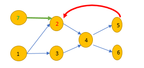

[TOC]

# 207. Course Schedule

> https://leetcode.com/problems/course-schedule/

>There are a total of *n* courses you have to take, labeled from `0` to `n-1`.
>
>Some courses may have prerequisites, for example to take course 0 you have to first take course 1, which is expressed as a pair: `[0,1]`
>
>Given the total number of courses and a list of prerequisite **pairs**, is it possible for you to finish all courses?

## Approach 1 : DFS topological sorting

```c++
class Solution {
private:
    vector<vector<int>> edges;
    vector<int> visited; // 0-no 1-visisting 2-visted
    
public:
    bool dfs_isCycle(int u) {
        if(1 == visited[u]) return true;
        if(2 == visited[u]) return false;

        visited[u] = 1;
        for (int v: edges[u]) {
            if (dfs_isCycle(v)) {
              return true;
            }
        }
        visited[u] = 2;


        return false;
    }

    bool canFinish(int numCourses, vector<vector<int>>& prerequisites) {
        edges.resize(numCourses);
        visited.resize(numCourses);
        for (const auto& info: prerequisites) {
            edges[info[1]].push_back(info[0]);
        }
        for (int i = 0; i < numCourses; ++i) {
            if (dfs_isCycle(i)) {
                return false;
            }
        }

        return true;
    }
};
```


Explanation:__

Q: How to distinguish the node that has been traversed from that is been traversing?

A: Set note state

* **$\textcolor{Green}{Waiting} $**
* **$\textcolor{Red}{Running} $**                                                       
* **$\textcolor{Black}{Over} $**



```java
class Solution {
    enum State {
        Waiting,
        Running,
        Over,
    }
    public boolean canFinish(int numCourses, int[][] prerequisites) {

        State[] mark = new State[numCourses];

        List<Integer>[] graph = new List[numCourses];
        for (int i = 0; i < numCourses; i++) {
            graph[i] = new ArrayList<Integer>();
            mark[i] = State.Waiting;
        }

        constructGraph(prerequisites, graph);

        for (int i = 0; i < numCourses; i++) {
            if (mark[i] == State.Over) continue;
            if (dfsHasCycle(graph, mark, i)) return false;
        }

        return true;
    }

    void constructGraph(int[][] pre, List<Integer>[] graph) {
        int n = graph.length;
        List<Integer> arr;
        for (int i = 0; i < pre.length; i++) {
            arr = graph[pre[i][1]];
            arr.add(pre[i][0]);
        }
    }

    boolean dfsHasCycle(List<Integer>[] graph, State[] mark, int cur) {
        boolean ret;
        int to;
        mark[cur] = State.Running;
        List<Integer> arr = graph[cur];
        for (int i = 0; i < arr.size(); i++) {
            to = arr.get(i);
            if (mark[to] == State.Running) return true;
            if (mark[to] == State.Waiting) {
                ret = dfsHasCycle(graph, mark, to);
                if (ret) return true;
            }
        }
        mark[cur] = State.Over;
        return false;
    }
}
```

>Runtime: ==2 ms==, faster than ==99.66%== of Java online submissions for Course Schedule.
>Memory Usage: ==51.9 MB==, less than ==27.69%== of Java online ==submissions== for Course Schedule.


## Approach 2: BFS

```c++
class Solution {
public:
    bool canFinish(int numCourses, vector<vector<int>>& prerequisites) {
        vector<int> res;
        vector<vector<int>> graph(numCourses, vector<int>());
        vector<int> deg(numCourses);
        for (auto& p : prerequisites) {
            graph[p[1]].push_back(p[0]);
            ++deg[p[0]];
        }
        queue<int> q;
        for (int i = 0; i < numCourses; ++i)
            if (deg[i] == 0)      q.push(i);
        		while (!q.empty()) {
            auto x = q.front(); q.pop();
          
            res.push_back(x);
            for (auto& neighbor : graph[x]) {
                if (--deg[neighbor] == 0) {
                    q.push(neighbor);
                }
            }
        }
        
        return res.size() == numCourses;
    }
};

```


```java
class Solution {

    public boolean canFinish(int numCourses, int[][] prerequisites) {

        char[] degree = new char[numCourses];
        List<Integer> zeroList = new ArrayList<>();

        List<Integer>[] graph = new List[numCourses];
        for (int i = 0; i < numCourses; i++) {
            graph[i] = new ArrayList<Integer>();
        }

        constructGraph(prerequisites, graph, degree, zeroList);

        int cur;
        int to;
        List<Integer> toList;
        while (!zeroList.isEmpty()) {
            cur = zeroList.remove(zeroList.size() - 1);
            toList = graph[cur];
            for (int i = 0; i < toList.size(); i++) {
                to = toList.get(i);
                degree[to]--;
                if (degree[to] == 0) {
                    zeroList.add(to);
                }
            }
        }

        for (int i : degree) {
            if (i != 0) {
                return false;
            }
        }

        return true;
    }

    void constructGraph(int[][] pre, List<Integer>[] graph, char[] degree, List<Integer> zeroList) {
        List<Integer> arr;
        for (int i = 0; i < pre.length; i++) {
            arr = graph[pre[i][1]];
            arr.add(pre[i][0]);
            degree[pre[i][0]]++;
        }

        for (int i = 0; i < degree.length; i++) {
            if (degree[i] == 0) {
                zeroList.add(i);
            }
        }
    }

}
```

>Runtime: ==3 ms==, faster than ==90.47%== of Java online submissions for Course Schedule.
>Memory Usage: ==47.1 MB==, less than ==46.16%== of Java online submissions for Course Schedule.

__Explanation:__

Iterate over nodes that  Indegree == 0.  and reduce indegree of the node that is directed to.

At last, once the indegree of all nodes is equal to 0, there is no cycle.

Otherwise, there is a cycle.


## Summary

### Java enum

written format as following

```java 
    enum STATE {
        WAIT,
        RUNNING,
        OVER
    }
	State[] mark = new State[numCourses];
	mark[cur] = State.Running;

   switch(state) {
      case BEGIN:
           ....
          break;
     default:     
           break;
   }

```


 

