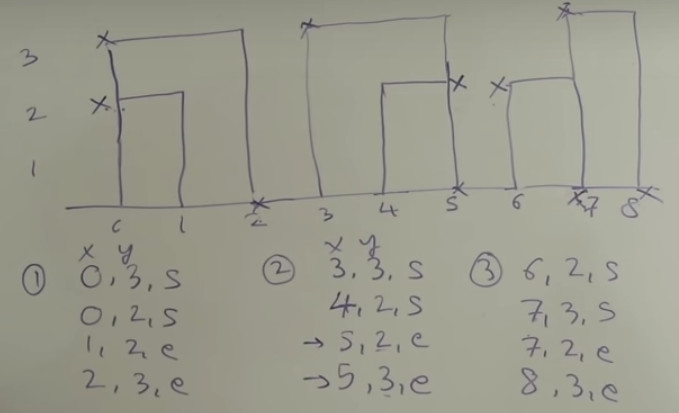
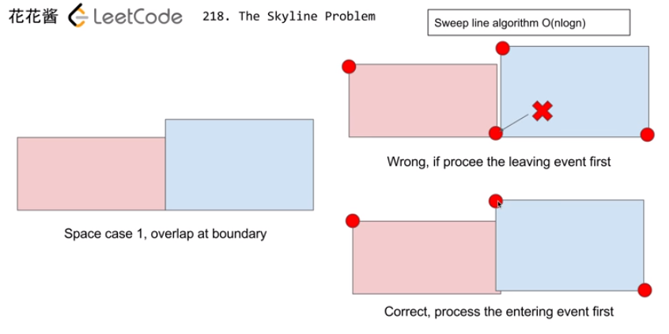
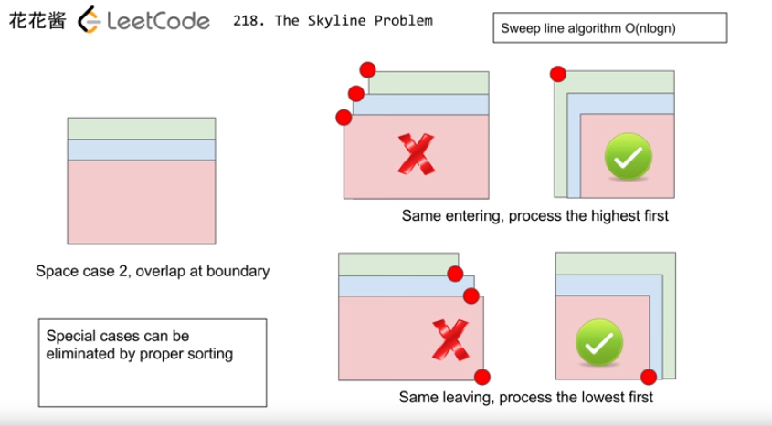
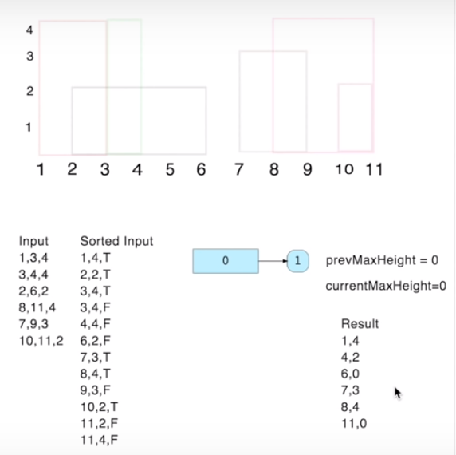

[toc]

# 218. The Skyline Problem

> https://leetcode.com/problems/the-skyline-problem/

> A city's skyline is the outer contour of the silhouette formed by all the buildings in that city when viewed from a distance. Now suppose you are **given the locations and height of all the buildings** as shown on a cityscape photo (Figure A), write a program to **output the skyline** formed by these buildings collectively (Figure B).

## Approach 1 : Priority Queue









```java
class Solution {
    private class Point implements Comparable<Point>{
        private int x;
        private int height;
        private boolean isStart;
        
        public Point(int x, int height, boolean isStart) {
            this.x = x;
            this.height = height;
            this.isStart = isStart;
        }
        
        // 比较规则复杂，主要是考虑到了三种边界情况
        public int compareTo(Point p) {
            if (this.x != p.x) {
                return this.x - p.x;
            } else {
                if (this.isStart && p.isStart) {
                    return p.height - this.height;
                } 
                if (!this.isStart && !p.isStart) {
                    return this.height - p.height;
                }
                return this.isStart?-1:1;
            }
        }
        
    }
    
    public List<List<Integer>> getSkyline(int[][] buildings) {
        int len = buildings.length;
        if (len == 0 || buildings[0].length == 0) {
            return new ArrayList<List<Integer>>();
        }
        // 每栋建筑有两个关键点
        Point[] points = new Point[len * 2];
        int index = 0;
        
        // 初始化所有关键点的数组
        for (int[] building : buildings) {
            int start = building[0];
            int end = building[1];
            int h = building[2];
            points[index++] = new Point(start,h,true);
            points[index++] = new Point(end,h,false);
            
        }
        // 将这些点按照我们希望的顺序排序
        Arrays.sort(points);
        // 用Collections.reverseOrder()来建立大根堆，这样就可以找到当前最高的高度
        PriorityQueue<Integer> queue = new PriorityQueue<>(Collections.reverseOrder());
        queue.offer(0);
        List<List<Integer>> res = new ArrayList<>();
        
        int prevMaxVal = 0;
        for (Point point : points) {
            if (point.isStart) {
                queue.offer(point.height);
                int curMaxVal = queue.peek();
                // 如果最大值变化了（只能变大），就说明这个点应该被记录
                
                if (curMaxVal > prevMaxVal) {
                    List<Integer> elm = new ArrayList<>(2);
                    elm.add(point.x);
                    elm.add(point.height);
                    res.add(elm);
                    prevMaxVal = curMaxVal;
                }
                
            } else {
                queue.remove(point.height);
                int curMaxVal = queue.peek();
                // 最大值变化了（只能变小），记录当前点
                if (curMaxVal < prevMaxVal) {
                    List<Integer> elm = new ArrayList<>(2);
                    elm.add(point.x);
                    elm.add(curMaxVal);
                    res.add(elm);
                    prevMaxVal = curMaxVal;
                }
                
            }
        }
        return res;
    }

}
```
>Runtime: 251 ms, faster than 10.17% of Java online submissions for The Skyline Problem.
>
>Memory Usage: 45.2 MB, less than 62.07% of Java online submissions for The Skyline Problem.

```java
class Solution {
        public List<List<Integer>> getSkyline(int[][] buildings) {
            List<List<Integer>> res = new ArrayList<>();
            List<int[]> height = new ArrayList<>();
            for(int[] b:buildings) {
                height.add(new int[]{b[0], -b[2]});
                height.add(new int[]{b[1], b[2]});
            }
            Collections.sort(height, (a, b) -> {
                    if(a[0] != b[0]) 
                        return a[0] - b[0];
                    return a[1] - b[1];
            });
            Queue<Integer> pq = new PriorityQueue<>((a, b) -> (b - a));
            pq.offer(0);
            int prev = 0;
            for(int[] h:height) {
                if(h[1] < 0) {
                    pq.offer(-h[1]);
                } else {
                    pq.remove(h[1]);
                }
                int cur = pq.peek();
                if(prev != cur) {
                    List<Integer> elm = new ArrayList<>(2);
                    elm.add(h[0]);
                    elm.add(cur);
                    res.add(elm);
                    prev = cur;
                }
            }
            return res;
    }
}
```

> Runtime: 250 ms, faster than 10.60% of Java online submissions for The Skyline Problem.
>
> Memory Usage: 44.5 MB, less than 62.07% of Java online submissions for The Skyline Problem.

## Approach 2 : Tree Map

```java
class Solution {
        public List<List<Integer>> getSkyline(int[][] buildings) {
           List<List<Integer>> points = new ArrayList<>();
            List<List<Integer>> results = new ArrayList<>();
            int n = buildings.length;
            //求出将左上角和右上角坐标, 左上角坐标的 y 存负数
            for (int[] b : buildings) {
                List<Integer> p1 = new ArrayList<>();
                p1.add(b[0]);
                p1.add(-b[2]);
                points.add(p1);

                List<Integer> p2 = new ArrayList<>();
                p2.add(b[1]);
                p2.add(b[2]);
                points.add(p2);
            }
            //将所有坐标排序
            Collections.sort(points, new Comparator<List<Integer>>() {
                @Override
                public int compare(List<Integer> p1, List<Integer> p2) {
                    int x1 = p1.get(0);
                    int y1 = p1.get(1);
                    int x2 = p2.get(0);
                    int y2 = p2.get(1);
                    if (x1 != x2) {
                        return x1 - x2;
                    } else {
                        return y1 - y2;
                    }
                }

            });
            TreeMap<Integer, Integer> treeMap = new TreeMap<>(new Comparator<Integer>() {
                @Override
                public int compare(Integer i1, Integer i2) {
                    return i2 - i1;
                }
            });
            treeMap.put(0, 1);
            int preMax = 0;

            for (List<Integer> p : points) {
                int x = p.get(0);
                int y = p.get(1);
                if (y < 0) {
                    Integer v = treeMap.get(-y);
                    if (v == null) {
                        treeMap.put(-y, 1);
                    } else {
                        treeMap.put(-y, v + 1);
                    }
                } else {
                    Integer v = treeMap.get(y);
                    if (v == 1) {
                        treeMap.remove(y);
                    } else {
                        treeMap.put(y, v - 1);
                    }
                }
                int curMax = treeMap.firstKey();
                if (curMax != preMax) {
                    List<Integer> temp = new ArrayList<>();
                    temp.add(x);
                    temp.add(curMax);
                    results.add(temp);
                    preMax = curMax;
                }
            }
            return results;
    }
}
```

> Runtime: 20 ms, faster than 66.56% of Java online submissions for The Skyline Problem.
>
> Memory Usage: 46.8 MB, less than 27.59% of Java online submissions for The Skyline Problem.

```java
class Solution {
        public List<List<Integer>> getSkyline(int[][] buildings) {
            List<List<Integer>> res = new ArrayList<>();
            List<int[]> height = new ArrayList<>();
            for(int[] b:buildings) {
                height.add(new int[]{b[0], -b[2]});
                height.add(new int[]{b[1], b[2]});
            }
            Collections.sort(height, (a, b) -> {
                    if(a[0] != b[0]) 
                        return a[0] - b[0];
                    return a[1] - b[1];
            });
    
            TreeMap<Integer, Integer> treeMap = new TreeMap<>((a, b) -> (b - a));
            treeMap.put(0, 1);
            int prev = 0;
            for(int[] h:height) {
                if(h[1] < 0) {
                    h[1] = -h[1];
                    treeMap.put(h[1], treeMap.getOrDefault(h[1], 0) + 1);
                }
                else {
                    Integer v = treeMap.get(h[1]);
                    if (v == 1) {
                        treeMap.remove(h[1]);
                    } else {
                        treeMap.put(h[1], v - 1);
                    }
                }
                int cur = treeMap.firstKey();
                if(prev != cur) {
                    List<Integer> elm = new ArrayList<>(2);
                    elm.add(h[0]);
                    elm.add(cur);
                    res.add(elm);
                    prev = cur;
                }
            }
            return res;
    }
}
```

> Runtime: 18 ms, faster than 75.73% of Java online submissions for The Skyline Problem.
>
> Memory Usage: 44.6 MB, less than 62.07% of Java online submissions for The Skyline Problem.

## Approach 3 : MultipSet

```c++
class Solution {
public:
    vector<vector<int>> getSkyline(vector<vector<int>>& buildings) {
        typedef pair<int, int> Event; 
        // events,  x,   h
        vector<Event> es;
        vector<int> elm(2, 0);
        hs_.clear();
        
        for (const auto& b : buildings) {
            es.emplace_back(b[0], b[2]);
            es.emplace_back(b[1], -b[2]);
        }
        
        // Sort events by x
        sort(es.begin(), es.end(), [](const Event& e1, const Event& e2){
            if (e1.first == e2.first) return e1.second > e2.second;
            return e1.first < e2.first;
        });
        
        vector<vector<int>> ans;
        
        // Process all the events
        for (const auto& e: es) {            
            int x = e.first;
            bool entering = e.second > 0;
            int h = abs(e.second);
            
            if (entering) {                
                if (h > this->maxHeight()) {
                    elm[0] = x;
                    elm[1] = h;
                    ans.push_back(elm);
                }
                hs_.insert(h);
            } else {
                hs_.erase(hs_.equal_range(h).first);
                if (h > this->maxHeight()) {
                    elm[0] = x;
                    elm[1] = this->maxHeight();
                    ans.push_back(elm);
                }
            }            
        }
        
        return ans;
    }
private:
    int maxHeight() const {
        if (hs_.empty()) return 0;
        return *hs_.rbegin();
    }
    multiset<int> hs_;
};
```

> Runtime: 32 ms, faster than 80.59% of C++ online submissions for The Skyline Problem.
>
> Memory Usage: 14.9 MB, less than 46.15% of C++ online submissions for The Skyline Problem.

## Summary

### 1. c++  multiset : `*hs_.rbegin();`

### 2. c++  forword: `es.emplace_back(b[0], b[2]);`

### 3. c++ compare

```c++
  sort(es.begin(), es.end(), [](const Event& e1, const Event& e2){
        if (e1.first == e2.first) return e1.second > e2.second;
        return e1.first < e2.first;
    })
```
## Reference

https://www.youtube.com/watch?v=GSBLe8cKu0s&feature=youtu.be&t=16