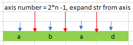
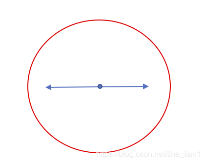
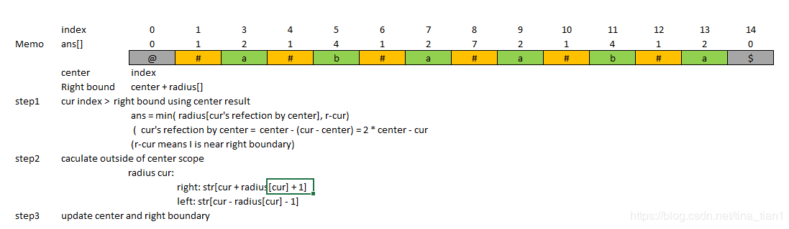
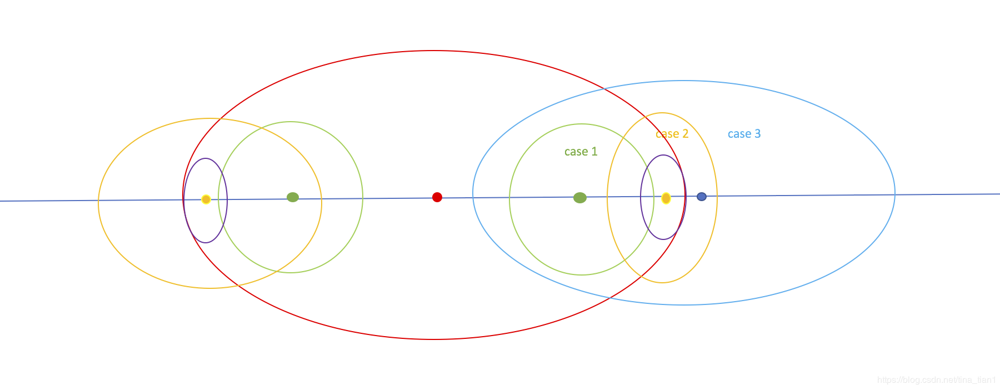

[toc]

# 5. Longest  Palindromic Substring

> https://leetcode.com/problems/longest-palindromic-substring/

> Given a string **s**, find the longest palindromic substring in **s**. You may assume that the maximum length of **s** is 1000.

## Approach 1 : Axis





```java
class Solution {
    public String longestPalindrome(String s) {

        int n = s.length();
        if (n < 2) return s;

        int ans = 1;
        int lpos = 0, rpos = 0;

        int low = 0, high = 0;
        int count = 2 * n - 1;
        int left, right;
        int len;
        for (int i = 0; i < count; i++) {
            low = i / 2;
            high = low + i % 2;
            
            left = 0;
            right = 0;
            while (low >= 0 && high < n && low <= high) {
                if (s.charAt(low) == s.charAt(high)) {
                    left = low--;
                    right = high++;
                    continue;
                } else {
                    break;
                }
            }
            len = right - left + 1;
            if (len > ans) {
                ans = len;
                lpos = left;
                rpos = right;
            }
        }
        return new String(s.substring(lpos, rpos + 1));
    }
}

```

> Runtime:  7 ms, faster than **69.59%** of Java online submissions for Longest Palindromic  Substring.
>
> Memory Usage: 35.7 MB, less than  100.00% of Java online submissions for Longest Palindromic Substring.


```java
class Solution {
    public String longestPalindrome(String s) {

        int n = s.length();
        if (n < 2) return s;

        int ans = 1;
        int lpos = 0, rpos = 0;

        int low = 0, high = 0;
        int count = 2 * n - 1;
        int left, right;

        int len;
        for (int i = 0; i < count; i++) {
            
            low = i / 2;
            high = low + i % 2;
            
            if(ans >= (n - low)*2) break; // add this line to optimize code
            left = 0;
            right = 0;
            while (low >= 0 && high < n && low <= high) {
                if (s.charAt(low) == s.charAt(high)) {

                    left = low--;
                    right = high++;
                    continue;
                } else {
                    break;
                }
            }
            len = right - left + 1;
            if (len > ans) {
                ans = len;
                lpos = left;
                rpos = right;
            }
        }
        return new String(s.substring(lpos, rpos + 1));
    }
}

```

> Runtime: 15 ms, faster than **77.11%** of Java online submissions for Longest Palindromic Substring.
>
> Memory Usage: 37.3 MB, less than 91.94% of Java online submissions for Longest Palindromic Substring.

```c++
class Solution {
public:
  string longestPalindrome(string s) {
    const int n = s.length();
    auto getLen = [&](int l, int r) {
      while (l >= 0 && r < n 
             && s[l] == s[r]) {
        --l;
        ++r;
      }
      return r - l - 1;
    };
    int len = 0;
    int start = 0;
    for (int i = 0; i < n; ++i) {
      int cur = max(getLen(i, i), 
                    getLen(i, i + 1));
      if (cur > len) {
        len = cur;
        start = i - (len - 1) / 2;
      }
    }
    return s.substr(start, len);
  }
};
```

> Runtime: 20 ms, faster than 78.82% of C++ online submissions for Longest Palindromic Substring.
>
> Memory Usage: 8.8 MB, less than 86.21% of C++ online submissions for Longest Palindromic Substring.

## Approach 2 : Manacher






```java
class Solution {
    public String longestPalindrome(String s) {
        int ansCenter = 0;

        int n = s.length();
        if (n < 2) return s;

        StringBuilder sb = new StringBuilder(2 * n + 3);

        sb.append('@');
        sb.append('#');
        for (int i = 0; i < n; i++) {
            sb.append(s.charAt(i));
            sb.append('#');
        }
        sb.append('$');

        String str = sb.toString();
        int[] redius = new int[2 * n + 3];
        int center = 0, right = 0;
        int maxRedius = 0;
        for (int i = 2; i < str.length() - 2; i++) {

            if (i < right) { 

                redius[i] = Math.min(redius[2 * center - i], right - i);
            }

            while (str.charAt(i + redius[i] + 1) == str.charAt(i - redius[i] - 1))
                redius[i]++;

            if (maxRedius < redius[i]) {
                maxRedius = redius[i];
                ansCenter = i;
            }

            if (right < i + redius[i]) {
                right = i + redius[i];
                center = i;
            }

        }

        int start = ansCenter - redius[ansCenter];
        int end = ansCenter + redius[ansCenter];

        start = (start + 1) / 2;
        end = (end - 1) / 2;

        return new String(s.substring(start - 1, end));

    }
}

```

> Runtime:  5 ms, faster than 97.03% of Java online submissions for Longest Palindromic  Substring.
>
> Memory Usage: 37.6 MB, less than  58.87% of Java online submissions for Longest Palindromic Substring.

## Summary

### 1. Refer to <a href="647.md">647.md </a>

