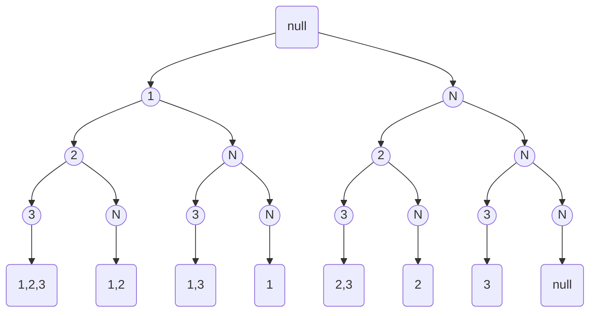
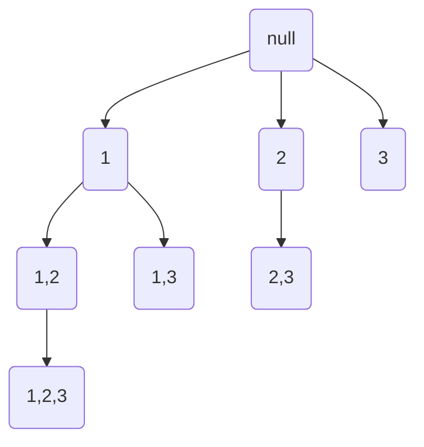

[toc]

# 78. Subsets

> https://leetcode.com/problems/subsets/

> Given a set of **distinct** integers, *nums*, return all possible subsets (the power set).
>
> **Note:** The solution set must not contain duplicate subsets.

## Approach 1: DP

* $$F(n + 1) = F(n) + [F(n) + (n+1)] $$

* E.g.

  $$[\ ]$$

  $$[\ ],[1]$$

  $$[\ ],[1],[2],[1,2]$$

  $$[\ ],[1],[2],[1,2],[3],[1,3],[2,3],[1,2,3]$$

```c++
class Solution {
public:
    vector<vector<int>> subsets(vector<int>& nums) {
        vector<vector<int>> result;
        result.push_back(vector<int>());
        int size;
        for(int j=0; j<nums.size(); j++) {
            size = result.size();
            for(int i=0; i<size; i++) {
                result.push_back(result[i]);
                result.back().push_back(nums[j]);
            }
        }
        return result;
    }
};
```

> Runtime: 4 ms, faster than 98.30% of C++ online submissions for Subsets.
>
> Memory Usage: 8.3 MB, less than 100.00% of C++ online submissions for Subsets.

## Approach 2 : Backtracking	

### Method 1 : DFS

* select num[i] or not. 




```java
class Solution {
    public List<List<Integer>> subsets(int[] nums) {
        List<List<Integer>> ret = new ArrayList<>();
        List<Integer> elm = new ArrayList<>();
        subsets(nums, 0, elm, ret);
        return ret;
    }
    
    void subsets(int[] nums, int cur, List<Integer> elm, List<List<Integer>> ret) {
        if(cur == nums.length) {
            ret.add(new ArrayList<Integer>(elm));
            return;
        }
        //1. contain this val
        elm.add(nums[cur]);
        subsets(nums, cur+1, elm, ret);
        //2. don't contain this val
        elm.remove(elm.size() - 1);
        subsets(nums, cur+1, elm, ret);
    }
}
```

> Runtime: 0 ms, faster than 100.00% of Java online submissions for Subsets.
>
> Memory Usage: 39.1 MB, less than 5.74% of Java online submissions for Subsets.

### Method 2 : BFS

*  start from num[i] 




```c++
class Solution {
public:
    vector<vector<int>> subsets(vector<int>& nums) {
        vector<int> item;
        vector<vector<int>> result;
        subsets(nums, 0, item, result);
        return result;
    }
    void subsets(vector<int>& nums, int start, vector<int>& item, vector<vector<int>>& result) {
        result.push_back(item);
        for(int i=start; i<nums.size(); i++) {
            item.push_back(nums[i]);
            subsets(nums ,i+1, item, result);
            item.pop_back();
        }
    }
};
```

> Runtime: 4 ms, faster than 98.30% of C++ online submissions for Subsets.
>
> Memory Usage: 8.2 MB, less than 100.00% of C++ online submissions for Subsets.

## Approach 3 : Bit Operation

* Example 

  Intput : $$[1, 2, 3]$$

  Output size : $$2^3 = 8$$

  ```mermaid
  graph TB
  	000 --> null
  	001 --> 1
  	010 --> 2
  	011 --> 1,2
  	100 --> 3
  	101 --> 1,3
  	110 --> 2,3
  	111 --> 1,2,3
  ```

  

```c++
class Solution {
public:
    vector<vector<int> > subsets(vector<int> &S) {
        int elem_num = S.size();
        int subset_num = pow (2, elem_num);
        vector<vector<int> > subset_set (subset_num, vector<int>());
        for (int i = 0; i < elem_num; i++)
            for (int j = 0; j < subset_num; j++)
                if ((j >> i) & 1)
                    subset_set[j].push_back (S[i]);
        return subset_set;
    }
};
```

> Runtime: 4 ms, faster than 98.30% of C++ online submissions for Subsets.
>
> Memory Usage: 8.2 MB, less than 100.00% of C++ online submissions for Subsets.