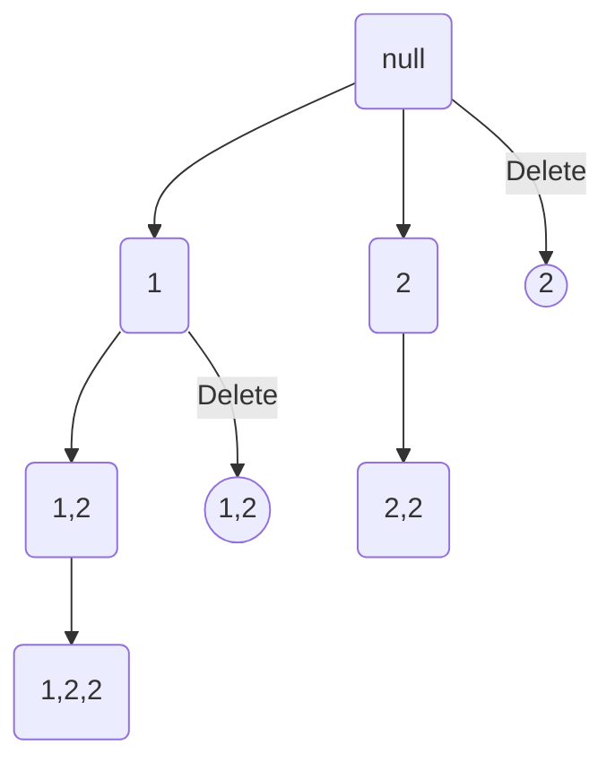

[toc]

#  90. Subsets II

> https://leetcode.com/problems/subsets-ii/

> Given a collection of integers that might contain duplicates, ***nums\***, return all possible subsets (the power set).
>
> **Note:** The solution set must not contain duplicate subsets.

## Approach 1 : DP

* e.g. intput [1, 2, 2, 2]

  Null: [ ]

  1: [\],[1]​

  2: [ ],[1],**[2],[1,2]**

  2: [ ],[1],[2],**[2,2],[1,2,2]​**

  2: [ ],[1],[2],[2,2],[1,2,2],**[2,2,2],[1,2,2,2]**

```c++
class Solution {
public:
    vector<vector<int>> subsetsWithDup(vector<int>& nums) {   
        sort(nums.begin(), nums.end());
        vector<vector<int>> result;
        result.push_back(vector<int>());
        int size;
        int preSize;
        int start;
        for(int j=0; j<nums.size(); j++) {      
           
            size = result.size();
            (j>0 && nums[j] == nums[j-1]) ? start = preSize :  start = 0;            
            preSize = size;
            
            for(int i=start; i<size; i++) {
                result.push_back(result[i]);
                result.back().push_back(nums[j]);
            }  
        }
        return result;
    }
    
};
```
>Runtime: 4 ms, faster than 99.59% of C++ online submissions for Subsets II.
>
>Memory Usage: 8.6 MB, less than 100.00% of C++ online submissions for Subsets II.

## Approach 2 : BFS

* e.g. intput [1, 2, 2]




```c++
class Solution {
public:
    vector<vector<int>> subsetsWithDup(vector<int>& nums) {   
        sort(nums.begin(), nums.end());    
        vector<int> item;
        vector<vector<int>> result;
        subsets(nums, 0, item, result);
        return result;
    }
    
    void subsets(vector<int>& nums, int start, vector<int>& item, vector<vector<int>>& result) {
        result.push_back(item);
        for(int i=start; i<nums.size(); i++) {
            if(i > start && nums[i-1] == nums[i]) continue; 
            item.push_back(nums[i]);
            subsets(nums ,i+1, item, result);
            item.pop_back();
        }
    }
};
```

>Runtime: 4 ms, faster than 99.59% of C++ online submissions for Subsets II.
>
>Memory Usage: 8.7 MB, less than 100.00% of C++ online submissions for Subsets II.

## Approach 3 : DFS

```c++
class Solution {
public:
    vector<vector<int>> subsetsWithDup(vector<int>& nums) {
        sort(nums.begin(), nums.end());    
        vector<int> item;
        set<vector<int>> ret;
        subsets(nums, 0, item, ret);
        return vector<vector<int>>(ret.begin(), ret.end());;
    }
    
   void subsets(vector<int>& nums, int cur, vector<int>& elm, set<vector<int>>& ret) {
        if(cur == nums.size()) {
            ret.insert(elm);
            return;
        }
        //1. contain this val
        elm.push_back(nums[cur]);
        subsets(nums, cur+1, elm, ret);
        //2. don't contain this val
        elm.pop_back();
        subsets(nums, cur+1, elm, ret);
    }
};


```

> Runtime: 12 ms, faster than 35.25% of C++ online submissions for Subsets II.
>
> Memory Usage: 14.1 MB, less than 22.73% of C++ online submissions for Subsets II.

### Optimize move

```c++
return vector<vector<int>>(ret.begin(), ret.end());
```

&rarr;

```c++
        vector<vector<int>> to;
        for (auto const &value : ret)
            to.push_back(move(value));
        return to;
```

```c++
class Solution {
public:
    vector<vector<int>> subsetsWithDup(vector<int>& nums) {
        sort(nums.begin(), nums.end());    
        vector<int> item;
        set<vector<int>> ret;
        subsets(nums, 0, item, ret);
                
        vector<vector<int>> to;
        for (auto const &value : ret)
            to.push_back(move(value));  //!!!
        return to;
        //return vector<vector<int>>(ret.begin(), ret.end());
    }
    
   void subsets(vector<int>& nums, int cur, vector<int>& elm, set<vector<int>>& ret) {
        if(cur == nums.size()) {
            ret.insert(elm);
            return;
        }
        //1. contain this val
        elm.push_back(nums[cur]);
        subsets(nums, cur+1, elm, ret);
        //2. don't contain this val
        elm.pop_back();
        subsets(nums, cur+1, elm, ret);
    }
};


```

> Runtime: 0 ms, faster than 100.00% of C++ online submissions for Subsets II.
>
> Memory Usage: 14.7 MB, less than 22.73% of C++ online submissions for Subsets II.