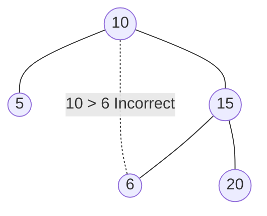

[Toc]

# 98. Validate Binary Search Tree

> https://leetcode.com/problems/validate-binary-search-tree/

> Given a binary tree, determine if it is a valid binary search tree (BST).
>
> Assume a BST is defined as follows:
>
> - The left subtree of a node contains only nodes with keys **less than** the node's key.
> - The right subtree of a node contains only nodes with keys **greater than** the node's key.
> - Both the left and right subtrees must also be binary search trees.

## Approach 1 : Recursion

### Hint：

Don't forget nodes of left tree is less than parent，and right ‘s is greater than parent.

```java
if((long)root.val <= leftVal || (long)root.val >= rightVal) return false;
```

Otherwise, there will be incorrect as following example.




```java

```

```java
/**
 * Definition for a binary tree node.
 * public class TreeNode {
 *     int val;
 *     TreeNode left;
 *     TreeNode right;
 *     TreeNode(int x) { val = x; }
 * }
 */
class Solution {
    public boolean isValidBST(TreeNode root) {
        if(root == null) return true;
        return helper(root, Long.MIN_VALUE, Long.MAX_VALUE);
    }
    
    public boolean helper(TreeNode root, long leftVal, long rightVal) {
        if(root == null) return true;
        
        if((long)root.val <= leftVal || (long)root.val >= rightVal) return false;
        
        if(root.left != null) {
            if(root.left.val >= root.val) return false;
            if(!helper(root.left, leftVal, root.val)) return false;
        }
        
        if(root.right != null) {
            if(root.right.val <= root.val) return false;
            if(!helper(root.right, root.val, rightVal)) return false;
        }
        
        return true;
    }
}
```

> Runtime: 0 ms, faster than 100.00% of Java online submissions for Validate Binary Search Tree.
>
> Memory Usage: 39.6 MB, less than 78.61% of Java online submissions for Validate Binary Search Tree.