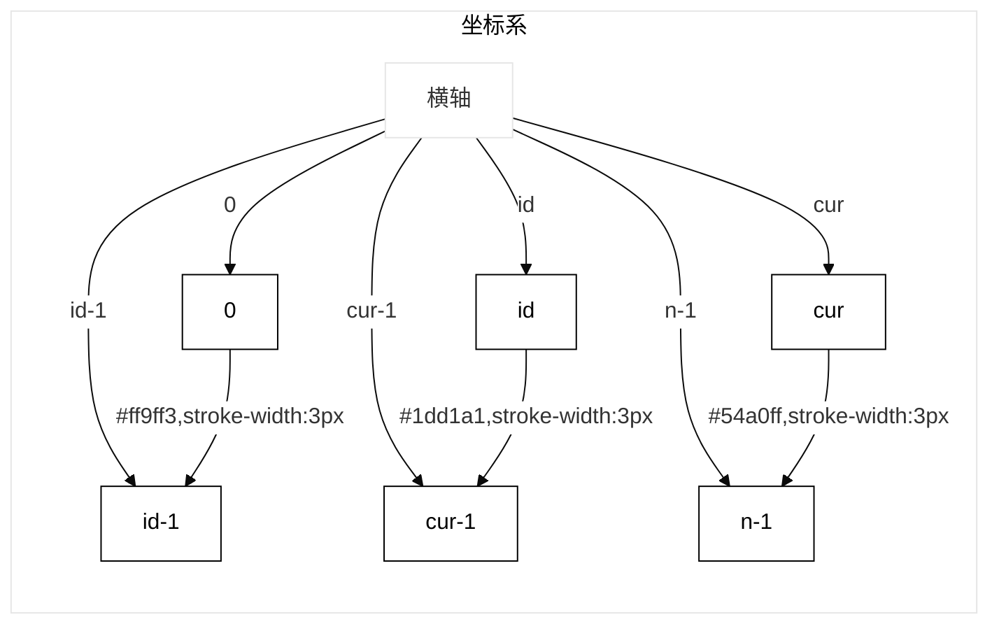
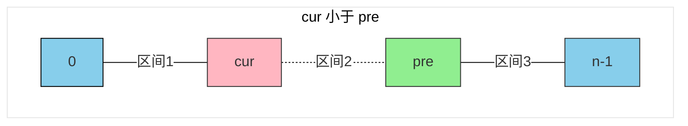
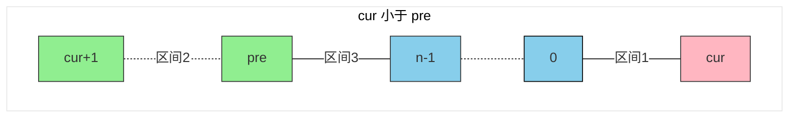
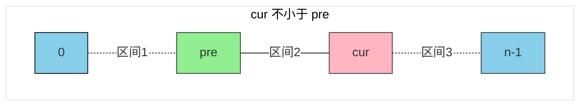

```mermaid
%%{init: {'theme': 'base', 'themeVariables': { 'primaryColor': '#fff', 'axisColor': '#000'}}}%%
graph LR
    subgraph 坐标系
        direction TB
        x-axis[横轴] --> |0|0
        x-axis --> |id-1|id-1
        x-axis --> |id|id
        x-axis --> |cur-1|cur-1
        x-axis --> |cur|cur
        x-axis --> |n-1|n-1
        
        style 0 fill:#fff,stroke:#000
        style id-1 fill:#fff,stroke:#000
        style id fill:#fff,stroke:#000
        style cur-1 fill:#fff,stroke:#000
        style cur fill:#fff,stroke:#000
        style n-1 fill:#fff,stroke:#000
        
        %% 彩色区间线条
        0 --"#ff9ff3,stroke-width:3px"--> id-1
        id --"#1dd1a1,stroke-width:3px"--> cur-1
        cur --"#54a0ff,stroke-width:3px"--> n-1
        
        %% 区间标签
        classDef interval1 fill:#ff9ff3,stroke:#000,color:#000
        classDef interval2 fill:#1dd1a1,stroke:#000,color:#000
        classDef interval3 fill:#54a0ff,stroke:#000,color:#000
        
        0:::interval1
        id-1:::interval1
        id:::interval2
        cur-1:::interval2
        cur:::interval3
        n-1:::interval3
    end
```

```mermaid
%%{init: {'theme': 'base', 'themeVariables': { 'primaryColor': '#fff', 'axisColor': '#000'}}}%%
graph LR
    subgraph cur 小于 pre
        direction LR

    
        style 0 fill:#87CEEB,stroke:#000
        style cur fill:#FFB6C1,stroke:#333
        style pre fill:#90EE90,stroke:#333
        style n-1 fill:#87CEEB,stroke:#333
        
        0 --- |区间1| cur
        cur -.- |区间2| pre
        pre --- |区间3| n-1
    end
```

```mermaid
%%{init: {'theme': 'base', 'themeVariables': { 'primaryColor': '#fff', 'axisColor': '#000'}}}%%
graph LR
    subgraph cur 小于 pre
        direction LR

    
        style 0 fill:#87CEEB,stroke:#000
        style cur fill:#FFB6C1,stroke:#333
        style cur+1 fill:#90EE90,stroke:#333
        style pre fill:#90EE90,stroke:#333
        style n-1 fill:#87CEEB,stroke:#333
        
       
        cur+1 -.- |区间2| pre
        pre --- |区间3| n-1
        n-1 -.- | | 0
        0 --- |区间1| cur
    end
```


```mermaid
%%{init: {'theme': 'base', 'themeVariables': { 'primaryColor': '#fff', 'axisColor': '#000'}}}%%
graph LR
    subgraph cur 不小于 pre
        direction LR

        style 0 fill:#87CEEB,stroke:#000
        style cur fill:#FFB6C1,stroke:#333
        style pre fill:#90EE90,stroke:#333
        style n-1 fill:#87CEEB,stroke:#333
        
        0 -.- |区间1| pre
        pre --- |区间2| cur
        cur -.- |区间3| n-1
    end
```


```
